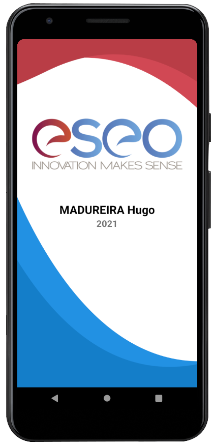

# Projet Final Android
> *Dernière mise à jour le 23 avril 2021*

Dans le cadre de la matière *Android* de mon cursus Ingénieur (Semestre 8), j'ai du développer une application en suivant **[un cahier des charges](#cahier-des-charges)** détaillés.

Vous pouvez me contacter sur **[LinkedIn](https://www.linkedin.com/in/hugo-madureira/)** si vous avez des questions.

## Mémo

Vous pouvez retrouver **[ici](memo/main.md)** mon apprentissage détaillé sur Android.

**Astuce, prise de note, cheat sheet, etc...**

## Vidéo

Voici **[la vidéo](https://youtu.be/lNYSYA7Xqec)** qui récapitule les fonctionnalités de l'application.

## Captures d'écran

Voici le ***splashscreen*** qui s'affiche au minimum 2sec.

## Cahier des charges

> *Cette partie est un copier coller du **[TP à rendre](https://cours.brosseau.ovh/tp/android/app-base-android.html)** de **[Valentin Brosseau](https://www.linkedin.com/in/valentin-brosseau-99b98827/)**.*

> ❌ = Je n'ai pas réussis ou eu le temps de réaliser la fonctionnalité
> 
> ✔️ = La fonctionnalité est complètement fonctionnel

L'application à fournir doit contenir au minimum les éléments suivants :

- ✔️ L'icône de l'application doit être personnalisée.
- ✔️ Les textes doivent être « i18n » (en Français et en Anglais)
- ✔️ La structure de votre application doit être rangée en « package », en suivant l'organisation proposé en cours, ou la vôtre si celle-ci montre une organisation compréhensible.
- ✔️ Un « splashscreen » qui s'affiche au minimum 2s. Celui-ci doit être constitué d'une image « logo », et d'un texte indiquant votre nom + prénom ainsi que l'année.
- ✔️ Une activity Home avec :
  - ✔️ Un logo
  - ✔️ 3 éléments cliquables :
    - ✔️ Localisation
    - ✔️ Historique des localisations précédemment réalisé.
    - ✔️ Paramétrages
- ✔️ Une activity Localisation permettant de :
  - ✔️ Localiser la personne (via le GPS ou le Réseau au choix).
  - ✔️ Une fois la localisation obtenue, la distance entre l'ESEO et sa position doit être affichée en kilomètre.
  - ✔️ À chaque localisation, à l'aide des SharedPreferences, enregistrez la demande pour la lister dans la vue « historique ».
  - ✔️ Vous devez gérer correctement le flow permission comme vue ensemble (avec gestion des erreurs)
- ✔️ Une activity Historique :
  - ✔️ Utilisation d'un Recyclerview.
    - ✔️ Affiche l'historique des positions enregistrées.
    - ✔️ Bonus : Action pour vider la liste.
    - ✔️ Bonus : Si la liste est vide, l'accès à cette activity doit être impossible.
    - ❌ Bonus : Ouverture de l'application « de cartographie » du téléphone à la position enregistrée.
    - ❌ Bonus : Affichage pour chaque élément du « reverse de la position GPS en texte » (comme vu ensemble).
  - ✔️ Une activity Paramètres :
    - ✔️ Utilisation d'un Recyclerview qui doit contenir :
    - ✔️ L'accès aux paramètres de l'application.
    - ✔️ L'accès au paramétrage de localisation du téléphone.
    - ✔️ Ouverture de l'application « carte » du téléphone sur la position géo de l'ESEO.
    - ✔️ Ouverture du site de l'ESEO.
    - ✔️ Ouverture de l'application « email » pour vous contacter. (lien type mailto)
